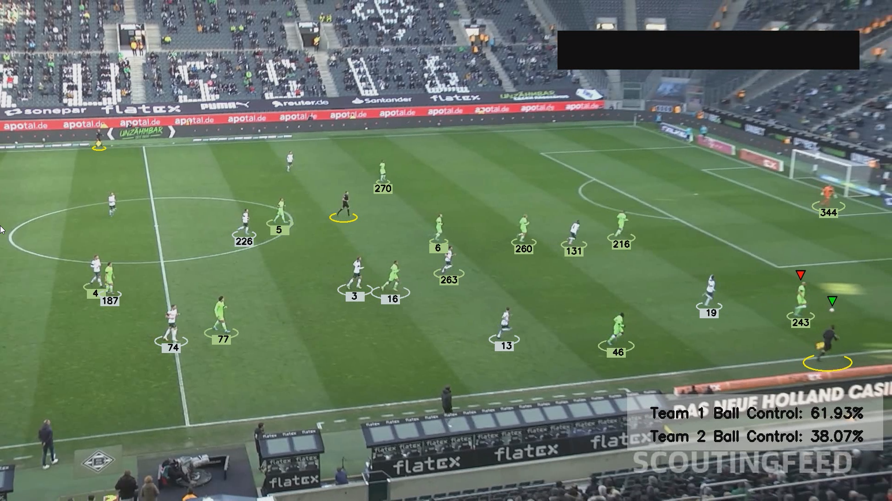
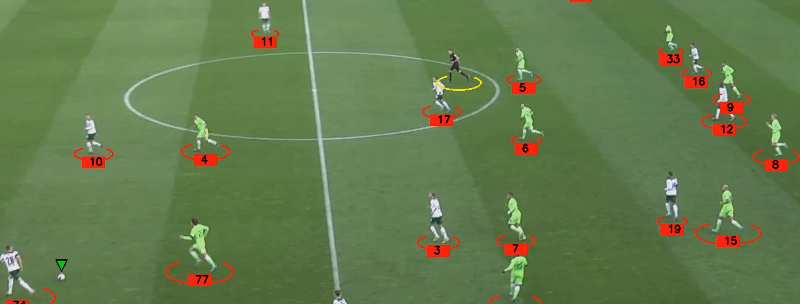
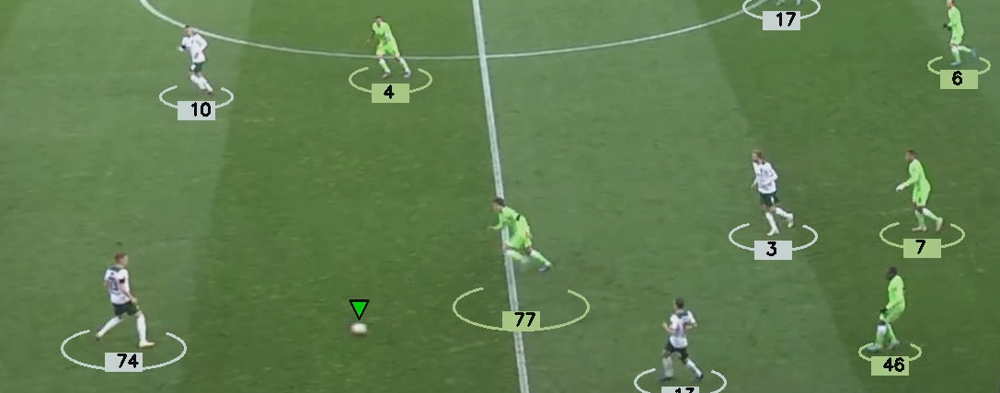
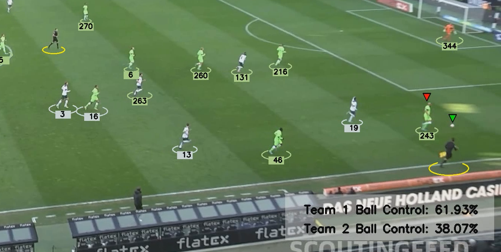

# FOOTBALL VISION: DETECTION AND TRACKING SYSTEM

## Introduction
This project builds a real-time system to detect, track, and identify players, referees, and the ball in football videos. It leverages custom training with **YOLOv5x** and uses **K-means clustering** for accurate player identification and team color assignment. The system seamlessly visualizes player movements, ball possession, and game dynamics.

## Key Features
- **YOLOv5x Detection:**	Applied transfer learning with YOLOv5x for real-time detection of players, referees, and football, utilizing a custom **Roboflow dataset** to achieve high-precision localization over 100 epochs at 640x640 resolution.
- **Track ID Object:**	Developed an object tracking feature using **ByteTracker** to consistently identify players, referees, and the ball across frames, processing detection outputs and maintaining **track IDs** for accurate object localization.
- **K-Means Clustering for Team Color:**  Implemented a color estimation feature utilizing **K-means clustering** for pixel-wise color analysis, enabling accurate team color assignment from bounding box detections and improving player identification within video frames. 
- **Ball Tracking & Possession:**	Performed ball position interpolation using pandas for accurate tracking and assigned ball possession to teams based on proximity calculations, using distance metrics to identify the nearest team player to the ball's center.
- **[Check Out the Demonstration](https://youtu.be/U8vdIITPX2s?si=ZOdI3MsBSkIyBZzF)**

## OUTPUT PICTURE
  

## Functionalities

**Track ID Assignment:**
- Track ID is assigned to each of the detected Player
  

**Team and Player Color Identification with K-means:**
- Team Color Identification done by indentifying firstly all detected players colors by K-means
- (Team1: White, Team2: Green)
  

**Ball Possession:**
- Ball Control of the Team is been analysed in real time frame by frame and updated continously
  

## Technologies Used
- Python, Pandas, NumPy, YOLO, ByteTrack, Supervision, CV2
